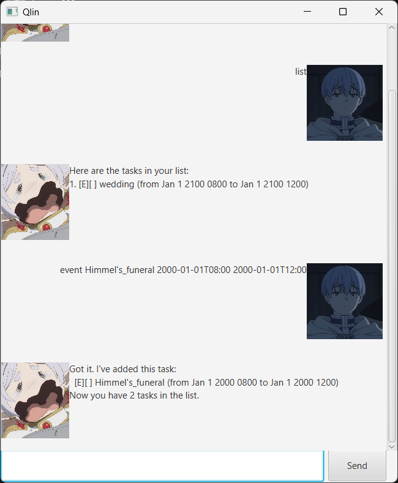

# Qlin User Guide

!

Welcome to my chatbot project, Qlin!

## Quick start
Ensure you have Java installed on your machine. Open your terminal and run the following command in the folder 
containing the `.jar` file:
`java -jar qlin.jar`

### Important

Task names and locations cannot contain spaces. 

Please use underscores (e.g., Team_meeting) or single words. 
Date and time must strictly follow the yyyy-MM-dd'T'HH:mm format (e.g., use a T between the date and time).

Please use `bye` command to terminate the chatbot, otherwise the change in the list will not be store.

### Commands

1. bye (terminates the program and close the GUI window immediately)
2. list (shows the list of added tasks)
3. todo `name` (add a todo task)
4. deadline `name` `due datetime` (add a deadline task)
5. event `name` `starting datetime` `ending datetime` `optional: location` (add an event tasks)
6. mark `index` (marks a task as done)
7. unmark `index` (unmarks a task)
8. delete `index` (delete a task)
9. find `search name` (search the task by name)
10. deleteAll (special command, deletes all tasks in the list)

## Feature: listing

It will show all the tasks that had been added into the chatbot.

Example: `list`

Here is the expected response from the chatbot,

```
Here are the tasks in your list:
1. [E][ ] wedding (from Jan 1 2100 0800 to Jan 1 2100 1200)
2. [E][ ] Himmel's_funeral (from Jan 1 2000 0800 to Jan 1 2000 1200)
```

## Feature: adding todos

It will add a todo task into a list inside the chatbot.

Format: `todo <name>`

Example: `todo homework`

Here is the expected response from the chatbot,

```
Got it. I've added this task:
  [T][ ] homework
Now you have 3 tasks in the list.
```

## Feature: adding deadlines

It will add a deadline task into a list inside the chatbot.

Format: `deadline <name> <due datetime>`

Note: Date and time must strictly follow the yyyy-MM-dd'T'HH:mm format (e.g., use a T between the date and time).

Example: `deadline homework 2012-12-12T00:00`

Here is the expected response from the chatbot,

```
Got it. I've added this task:
  [D][ ] homework (due at Dec 12 2012 0000)
Now you have 4 tasks in the list.
```


## Feature: adding events

It will add an event task into a list inside the chatbot.

Format: `event <name> <starting datetime> <ending datetime>`

Example: `event Himmel's_departure 1950-01-01T10:00 1950-01-01T12:00`

Optional parameter: location

Format: `event <name> <starting datetime> <ending datetime> <location>`

Example: `event Himmel's_departure 1950-01-01T10:00 1950-01-01T12:00 Capital_City`

Here is the expected response from the chatbot,

```
Got it. I've added this task:
  [E][ ] Himmel's_depature (from Jan 1 1950 1000 to Jan 1 1950 1200, location: Capital_City)
Now you have 5 tasks in the list.
```

## Feature: marking and unmarking task

It will mark or unmark a task.

Format:
```
mark <index>
unmark <index>
```

Example:
```
mark 1
unmark 1
```

Expected response for marking,
```
Nice! I have marked this task as done:
 [E][X] wedding (from Jan 1 2100 0800 to Jan 1 2100 1200)
```

Expected response for unmarking,
```
OK, I've marked this task as not done yet:
 [E][ ] wedding (from Jan 1 2100 0800 to Jan 1 2100 1200)
```

## Feature: deleting task

It will delete a task from the list.

Format: `delete <index>`

Example: `delete 1`

Here is the expected response from the chatbot,
```
Noted. I've deleted this task:
 [E][ ] wedding (from Jan 1 2100 0800 to Jan 1 2100 1200)
Now you have 4 tasks in the list.
```

## Feature: finding task by name

It will search the list using the user's input and returns a list of tasks with the same partial name.

Format: `find <search name>`

Example: `find home`

Here is the expected response from the chatbot,
```
Here are the matching tasks in your list:
1. [T][ ] homework
2. [D][ ] homework (due at Dec 12 2012 0000)
```

## Feature: storing previous added tasks

Previous added tasks will be store in a text file, qlin.txt. Upon execution, the store data will be loaded back into 
the list , reconstructing the user's list back to the state before the last termination of the chatbot. If no such file 
exists, the chatbot will create automatically upon execution.

However, the change of the tasks in the list will only be stored if the user terminates the chatbot through "bye" 
command. Terminating the chatbot manually will result in loss of data, any creation and operation on the tasks will 
not be stored.